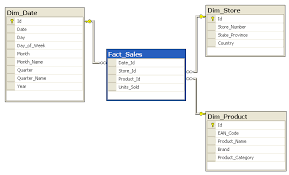
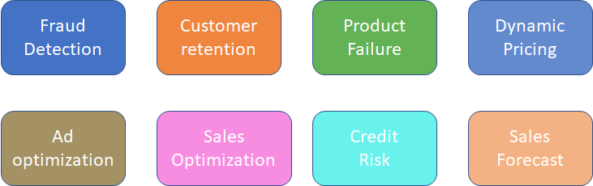
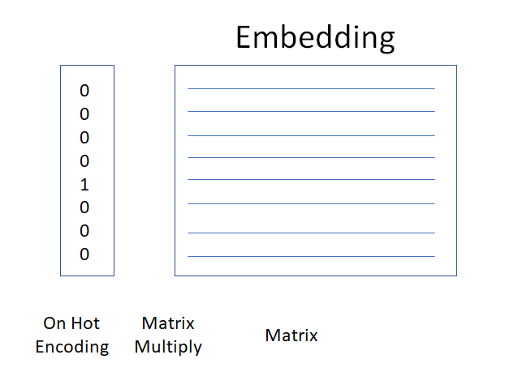

## Intro

Scott Mueller
smueller.tampa.ai@gmail.com

MomsSafetyNet.com
---
## Tampa.ai

Looking for Presenters

---
# Tabular Data Predictions with Neural Nets
---
* Why?
* Business Data
* Feature Engineering
* Using Fast.ai
* Concerns with Neural Nets
* Transfer Learning

---
## Why Neural Nets?

* Reduced Effort in Feature Engineering
> Pinterest: Hand created features unnecessary

> More accurate, less maintenance

---
* Can model arbitrary function
* Better at Generalizing for Unseen Situations
* Improve with Neural Net improvements
---
## Business Data
* Tabular Data found in Most Businesses



Possible to Extract to Spreadsheet
---
## Example Models

---
## Business Objective

* Optimizing Business Value
---
## Denormalize Data


---
[X] => f(X) = [Y]

* Input Tensor
* Some function across the inputs
* Some prediction, single or array 
---
## Feature Engineering

* What is Important about our Input Data?
* Choice is Easier with Neural Net
---
Continuous Values

[1.3, 2.1, 1.8, 2.5,...]
---
## Categorical Data becomes Embedding Data

* Levels become continuous values

 [0.20, 0.82, 0.45, 0.67]

---



[0.20, 0.82, 0.45, 0.67, 0.3, 0.28, 0.52]

Matrix values are learned when training model
---
## Features which make it easier to train model

* Add features that help in your domain
---
## Key Choices

Treat values as continuous or categorical

How big should each embedding matrix be?
> embedding per categorical

> auto-calc or specified
---
## Fast.ai

Improvements in the library make working with Tabular data even easier

https://github.com/fastai/fastai

---
## Special Categorical
* Date
```python
add_datepart(weather, "Date", drop=False)
add_datepart(googletrend, "Date", drop=False)
```
DayOfWeek, Year, Month, Day, DayOfMonth, DayOfYear, Is_Month_End

---
## Step 1: Identifying Categorical vs Continuous

```python
  cat_vars = ['Store', 'DayOfWeek', 'Year', 'Month', 'Day', 'StateHoliday', 'CompetitionMonthsOpen',
    'Promo2Weeks', 'StoreType', 'Assortment', 'PromoInterval', 'CompetitionOpenSinceYear', 'Promo2SinceYear',
    'State', 'Week', 'Events', 'Promo_fw', 'Promo_bw', 'StateHoliday_fw', 'StateHoliday_bw',
    'SchoolHoliday_fw', 'SchoolHoliday_bw']

  contin_vars = ['CompetitionDistance', 'Max_TemperatureC', 'Mean_TemperatureC', 'Min_TemperatureC',
   'Max_Humidity', 'Mean_Humidity', 'Min_Humidity', 'Max_Wind_SpeedKm_h', 
   'Mean_Wind_SpeedKm_h', 'CloudCover', 'trend', 'trend_DE',
   'AfterStateHoliday', 'BeforeStateHoliday', 'Promo', 'SchoolHoliday']
   ```

---
## Example Models

https://colab.research.google.com/drive/15Bg4bQfuV1Nr2KRVxkVz-XbU5QwfeWUw#scrollTo=RHqVkRcWBKRB

https://colab.research.google.com/drive/1-4Q95kHW-gWGAly99vxugom5shuISErP

---
## Embeddings Are Reusable

* Improves Shallow Learning

Rossman paper showed that using the Embeddings from Neural Net
Improved the performance of the Gradient Boosting and Random
Forest implementations for the same problem

---
## Concerns

* Interpretation/Interpretability

* Performance
---
## Feature Importance In Structure Data Networks
(http://parrt.cs.usfca.edu/doc/rf-importance/index.html)
> scikit and R feature importance is biased

> To get reliable results in Python, use permutation importance

---

## Column Permutation
* Once model is trained, run the test set with one column randomly reordered

> Retains the distribution

> Impact of Loss represents importance

---
## Drop Column

* Train muliple other models without one column

* Difference in loss is the impact of column
---
## Performance

* Ongoing research area
> Quantization, FP16, FP8, Distillation

* Hardware improvement to CPU systems
---
## Transfer Learning


Remove icing on top, add domain specific layers
---
## Image Transfer Learning

* Base/Stem Architecture
> ResNet

* Head Layers

Train with Frozen Layers, then Discriminitive Learning Rates
---
## NLP

* ImageNet moment last year?

---
## NLP Base 

* Self-supervized Learning 

> we have labels, labels are not things that somebody else created

* ULMfit -> Language Model

> Predict the next word

---
## NLP Head

* Freeze base layers and Train on Target Task

* Optionally Unfreeze

---
## How does that apply to Tabular Data?

* Is predicting sales the business objective?

* Predict Sales

* Add layers train on Human annotated data
---

